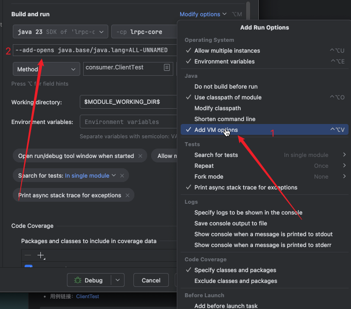

# 一个使用java新特性虚拟线程，结合netty，编写的一个基于自定义协议的RPC（远程过程调用）框架
## 项目说明
### 1: 为什么重复造轮子？
- 本项目是为了学习RPC框架的原理，所以实现了一个简单的RPC框架，再加上最近在学习java的新特性虚拟线程，结合netty，编写了这个RPC框架。若公司需自研RPC框架，前期可以参考本项目的实现，后期再根据公司的需求进行定制化开发。后续有什么问题，也欢迎积极交流，共同学习，看到后会在有空的第一时间回应。
### 2: 项目的特点
- 本项目使用Java新特性虚拟线程 + netty + 简单自定义协议实现的RPC框架，支持服务注册发现、负载均衡，实现简单高效且能承受一定的并发量的远程调用。（注：目前虚拟线程主要用在服务端的worker线程中）


# 模块说明
## 1:lrpc-core
- rpc框架的核心代码，适用于一般的maven项目,主要包括以下几个部分
    - client：rpc框架的客户端,主要包括了客户端的连接管理、请求发送、请求接收、负载均衡等功能；
    - server：rpc框架的服务端,主要包括了服务端的serverSocket监听、请求接收、请求处理、响应发送等功能；
    - registry：rpc框架的服务注册中心,主要包括了服务注册、服务发现等功能；
    - common：rpc框架的公共模块,主要包括了一些公共的工具类、协议编解码定义、注解定义；
    - example：rpc框架的用例的示例接口及实现类，供测试使用；

## 2:lrpc-spring-boot-starter
- rpc框架的spring-boot集成,适用于spring-boot项目,提供了自动配置功能,该module依赖lrpc-core,主要包括以下几个部分
    - autoconfigure：rpc框架的自动配置模块,主要包括了rpc框架的自动配置类；
    - annotation：rpc框架的注解模块, 主要包括了rpc框架在spring-boot项目中使用的注解，如服务提供者@LrpcService、服务消费者@LrpcReference、服务扫描包@LrpcScan等；
    - properties：rpc框架的配置模块,有LrpcProperties类的子类，主要是利用spring-boot的配置文件进行rpc框架的配置；
    - spring：rpc框架的spring集成模块,主要包括了rpc框架在spring-boot项目中的一些扩展功能。主要实现了BeanPostProcessor接口，用于扫描服务提供者、服务消费者等注解，并进行相应的处理，这也是rpc框架注入到spring容器中的入口；

## 3:lrpc-example
- 该module是rpc框架的简单使用示例,也是一个spring-boot项目
    - server：rpc框架的服务提供者示例，主要包括了服务提供者的配置、服务接口的实现、服务的注册等；
  
# 使用方式
## 前置说明
  在test目录下有相应的测试用例，可以参考测试用例的使用方式，若要使用zk作为注册中心，需要在application.properties中配置zk的地址
#### 

**由于服务提供者的线程使用了虚拟线程，所以需要在启动类中添加以下参数，强制修改了java类的内部属性，所以在本地启动，或者启动脚本中添加以下参数**

### 以下三选一
### 方案1: IDEA单个添加参数方式

### 方案2: IDEA添加参数模版，后续每次启动都会自动添加


### 方案3: 启动脚本添加参数方式
```shell
--add-opens java.base/java.lang=ALL-UNNAMED
````


### 1:lrpc-core的使用方式
- 服务端
#### 用例链接：[ServerTest](lrpc-core/src/test/java/server/ServerTest.java)
```java

@Test
public void testStartServer() throws IOException {
    // 给threadLocal赋值
    final var properties = new LrpcPropertiesCore();
    PROPERTIES_THREAD_LOCAL.set(properties);

    // 启动提供者
    final var provider = new Provider();
    provider.start();

    // 注册服务
    final var testService = new TestServiceImpl();
    provider.registry(testService, properties.getServer().getPort());
    System.out.println("服务启动成功");

    // 阻塞主线程,不让服务停止
    System.in.read();
}
```

- 客户端
- 用例链接：[ClientTest](lrpc-core/src/test/java/consumer/ClientTest.java)
```java

@Test
public void testClient() throws LRPCTimeOutException {
    // 给threadLocal赋值
    final var lrpcProperties = new LrpcPropertiesCore();
    PROPERTIES_THREAD_LOCAL.set(lrpcProperties);

    // 启动服务
    Comsumer comsumer = new Comsumer();

    // 获取代理,注册中心使用本地注册时（相当于不使用注册中心），需要传入服务端的地址
    final var service = comsumer.getProxy(TestService.class, Set.of(Pair.of("127.0.0.1", lrpcProperties.getServer().getPort())));
    // 使用注册中心时，只需要传入服务名即可负载均衡的调用服务
    // final var service = comsumer.getProxy(TestService.class);

    // 调用方法
    final var result = service.hello("张三");
    log.info("测试结束, 结果: {}", result);
}
```


### 2:lrpc-spring-boot-starter的使用方式(其实就是按照lrpc-example模块的使用方式)
先添加相关依赖
```xml

<dependencys>
<!--  添加lrpc-spring-boot-starter依赖 -->
    <dependency>
        <groupId>cn.jgzhan.lrpc</groupId>
        <artifactId>lrpc-spring-boot-starter</artifactId>
        <version>@{lrpcSpringbootVersion}</version>
    </dependency>
<!--    spring-boot依赖及test依赖 -->
    <dependency>
        <groupId>org.springframework.boot</groupId>
        <artifactId>spring-boot-starter-test</artifactId>
        <scope>test</scope>
    </dependency>
    <dependency>
        <groupId>org.springframework.boot</groupId>
        <artifactId>spring-boot-starter</artifactId>
    </dependency>
</dependencys>
```

- spring-boot服务就不区分服务端和客户端了，因为有提供服务也有消费服务，所以既是服务端也是客户端，所以只需要添加注解即可；
- 用例链接：[LrpcExampleApplicationTests.java](lrpc-example/src/test/java/lrpc_example/LrpcExampleApplicationTests.java)
```java
@SpringBootTest(classes = LrpcExampleApplication.class)
class LrpcExampleApplicationTests {

    //	@Autowired
    @LrpcReference
    private HelloService helloService;
    @LrpcReference
    private TestService testService;
    @Autowired
    private LrpcProperties lrpcProperties;

    @Test
    void contextLoads() throws InterruptedException {
        for (int i = 0; i < 50; i++) {
            Thread.sleep(1000);
//            System.out.println(exampleService.call("jgzhan" + i));
            System.out.println(helloService.sayHello("jgzhan" + i));
//            System.out.println(testService.hello("jgzhan" + i));
        }
    }


}
```