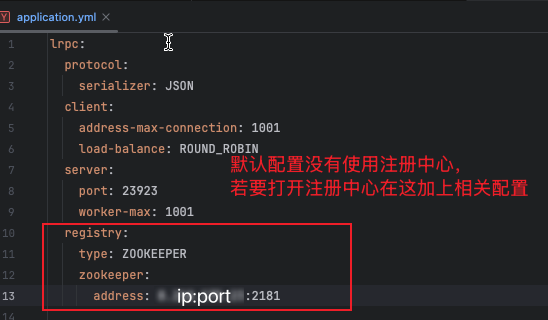

# An RPC (Remote Procedure Call) framework based on a custom protocol, written using Java's new virtual threads and Netty


中文版: [README.md](README.md)｜English version: [README_EN.md](README_EN.md) 

## Project Description
### 1: Why reinvent the wheel?
- This project is to learn the principles of RPC frameworks, so a simple RPC framework was implemented. Additionally, with the recent study of Java's new virtual threads, this RPC framework was written using Netty. If a company needs to develop its own RPC framework, the implementation of this project can be referred to in the early stages, and then customized according to the company's needs in the later stages. If there are any questions, feel free to actively communicate and learn together. I will respond as soon as I have time.
### 2: Project Features
- This project uses Java's new virtual threads + Netty + a simple custom protocol to implement an RPC framework that supports service registration and discovery, load balancing, and achieves simple and efficient remote calls that can handle a certain amount of concurrency. (Note: Currently, virtual threads are mainly used in the server's worker threads)

# Module Description
## 1: lrpc-core
- The core code of the RPC framework, suitable for general Maven projects, mainly includes the following parts:
    - client: The client of the RPC framework, mainly including connection management, request sending, request receiving, load balancing, etc.;
    - server: The server of the RPC framework, mainly including serverSocket listening, request receiving, request processing, response sending, etc.;
    - registry: The service registry of the RPC framework, mainly including service registration, service discovery, etc.;
    - common: The common module of the RPC framework, mainly including some common utility classes, protocol codec definitions, annotation definitions;
    - example: Example interfaces and implementation classes for the RPC framework, used for testing;

## 2: lrpc-spring-boot-starter
- The Spring Boot integration of the RPC framework, suitable for Spring Boot projects, provides automatic configuration functions. This module depends on lrpc-core and mainly includes the following parts:
    - autoconfigure: The auto-configuration module of the RPC framework, mainly including the auto-configuration classes of the RPC framework;
    - annotation: The annotation module of the RPC framework, mainly including annotations used in Spring Boot projects, such as service provider @LrpcService, service consumer @LrpcReference, service scan package @LrpcScan, etc.;
    - properties: The configuration module of the RPC framework, with subclasses of LrpcProperties, mainly using Spring Boot configuration files for RPC framework configuration;
    - spring: The Spring integration module of the RPC framework, mainly including some extended functions of the RPC framework in Spring Boot projects. It mainly implements the BeanPostProcessor interface, used to scan service provider and service consumer annotations, and perform corresponding processing. This is also the entry point for the RPC framework to be injected into the Spring container;

## 3: lrpc-example
- This module is a simple usage example of the RPC framework and is also a Spring Boot project:
    - server: Example of the service provider of the RPC framework, mainly including the configuration of the service provider, implementation of the service interface, service registration, etc.;

# Usage
## Prerequisites
  There are corresponding test cases in the test directory, which can be referred to for usage. If you want to use Zookeeper as the registry, you need to configure the Zookeeper address in the application.properties file.
#### 

### 1: Usage of lrpc-core
- Server
- Example link: [ServerTest](lrpc-core/src/test/java/server/ServerTest.java)
```java
@Test
public void testStartServer() throws IOException {
    // Set threadLocal value
    final var properties = new LrpcPropertiesCore();
    PROPERTIES_THREAD_LOCAL.set(properties);

    // Start provider
    final var provider = new Provider();
    provider.start();

    // Register service
    final var testService = new TestServiceImpl();
    provider.registry(testService, properties.getServer().getPort());
    System.out.println("Service started successfully");

    // Block the main thread to prevent the service from stopping
    System.in.read();
}
```

- Client
- Example link: [ClientTest](lrpc-core/src/test/java/consumer/ClientTest.java)
```java
@Test
public void testClient() throws LRPCTimeOutException {
    // Set threadLocal value
    final var lrpcProperties = new LrpcPropertiesCore();
    PROPERTIES_THREAD_LOCAL.set(lrpcProperties);

    // Start service
    Comsumer comsumer = new Comsumer();

    // Get proxy, when using local registration (equivalent to not using a registry), you need to pass in the server address
    final var service = comsumer.getProxy(TestService.class, Set.of(Pair.of("127.0.0.1", lrpcProperties.getServer().getPort())));
    // When using a registry, you only need to pass in the service name to call the service with load balancing
    // final var service = comsumer.getProxy(TestService.class);

    // Call method
    final var result = service.hello("John Doe");
    log.info("Test ended, result: {}", result);
}
```

### 2: Usage of lrpc-spring-boot-starter (actually following the usage of the lrpc-example module)
First, add the relevant dependencies
```xml
<dependencies>
    <!-- Add lrpc-spring-boot-starter dependency -->
    <dependency>
        <groupId>cn.jgzhan.lrpc</groupId>
        <artifactId>lrpc-spring-boot-starter</artifactId>
        <version>@{lrpcSpringbootVersion}</version>
    </dependency>
    <!-- Spring Boot dependencies and test dependencies -->
    <dependency>
        <groupId>org.springframework.boot</groupId>
        <artifactId>spring-boot-starter-test</artifactId>
        <scope>test</scope>
    </dependency>
    <dependency>
        <groupId>org.springframework.boot</groupId>
        <artifactId>spring-boot-starter</artifactId>
    </dependency>
</dependencies>
```

- Spring Boot services do not distinguish between server and client, because they both provide and consume services, so they are both server and client. You only need to add annotations;
- Example link: [LrpcExampleApplicationTests.java](lrpc-example/src/test/java/lrpc_example/LrpcExampleApplicationTests.java)
```java
@SpringBootTest(classes = LrpcExampleApplication.class)
class LrpcExampleApplicationTests {

    @LrpcReference
    private HelloService helloService;
    @LrpcReference
    private TestService testService;
    @Autowired
    private LrpcProperties lrpcProperties;

    @Test
    void contextLoads() throws InterruptedException {
        for (int i = 0; i < 50; i++) {
            Thread.sleep(1000);
            System.out.println(helloService.sayHello("jgzhan" + i));
        }
    }
}
```

### 3: Adding a component to record access counts
To add a component that records access counts, you can create a simple counter service and integrate it into your existing services.

- Create a new service interface `CounterService`:
```java
public interface CounterService {
    void increment();
    int getCount();
}
```

- Implement the `CounterService`:
```java
@LrpcService
public class CounterServiceImpl implements CounterService {
    private int count = 0;

    @Override
    public synchronized void increment() {
        count++;
    }

    @Override
    public synchronized int getCount() {
        return count;
    }
}
```

- Inject and use the `CounterService` in your existing services:
```java
@SpringBootTest(classes = LrpcExampleApplication.class)
class LrpcExampleApplicationTests {

    @LrpcReference
    private HelloService helloService;
    @LrpcReference
    private TestService testService;
    @LrpcReference
    private CounterService counterService;
    @Autowired
    private LrpcProperties lrpcProperties;

    @Test
    void contextLoads() throws InterruptedException {
        for (int i = 0; i < 50; i++) {
            Thread.sleep(1000);
            System.out.println(helloService.sayHello("jgzhan" + i));
            counterService.increment();
            System.out.println("Access count: " + counterService.getCount());
        }
    }
}
```